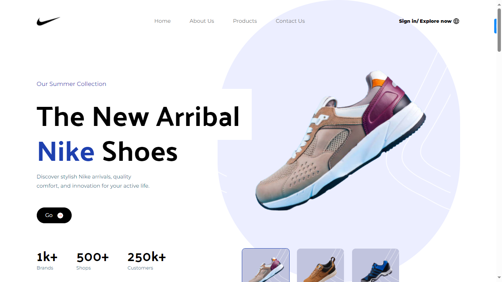

# Nike landing page

Simple landing page to demostrate some skills by using tailwind and react.




## Getting Started


### Prerequisites


* HTML/CSS
* JavaScript
* React.js
* Tailwind Css

### Installation

A step by step guide that will tell you how to get the development environment up and running.

```
$ npm install (Install node dependecies)
$ npm run dev (Run server)
```


## Deployment

[click here to check live version](https://dev--lucky-moxie-8d5dd8.netlify.app/)

## Additional Documentation and Acknowledgments

* JavaScript Master
* tailwind
* etc...